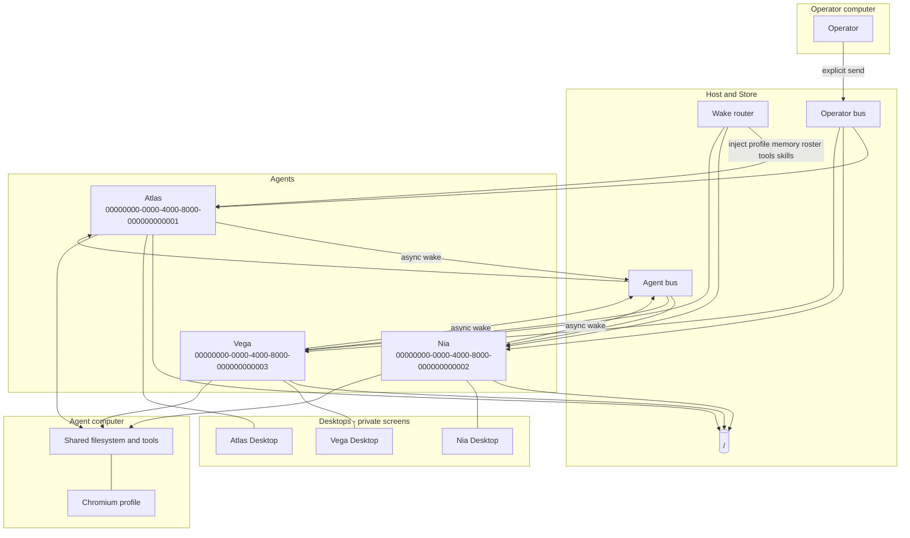

<p align="center">
  
</p>

# InsideMan

Architecture specification for a Grok Bot-class multi-agent desktop product.

This repository documents the **product**, not a live deployment. Examples use only the fictional Agents Atlas, Nia, and Vega. The human is always **the operator**. Paths are placeholders: `<store>/`, `<agent-computer>/`, `<operator-computer>/`.

Terms used here match [glossary.md](glossary.md). Do not introduce synonyms.

## Architecture in one page

Grok Bot is a multi-agent runtime, not one chatbot.

An [Agent](docs/02-identity.md) is a durable person. Canonical identity is a UUID. Display name is not the key. Durable state lives on disk under `<store>/agents/<uuid>/`. The model is stateless per [Wake](docs/04-turns-and-runtime.md): each turn injects profile, memory, teammate roster, tools, and the skills catalog. The hard part of a rebuild is the Wake router — durable people, stateless turns.

There are two computers and a private Desktop per Agent:

- The [Agent computer](docs/05-shared-computer-and-desktop.md) is one Linux machine shared by all of the operator's Agents. Same filesystem, installed tools, and browser logins. Persistent across turns.
- The [Operator computer](docs/06-operator-computer.md) is the human's machine. Access is an approval-gated bridge. File copy works both ways. A path on one computer is not visible on the other.
- A Desktop is per-Agent, not per-machine. Shared machine, private screen. An Agent cannot see another Agent's Desktop, and cannot click, type, or scroll its own. Interactive GUI work is delegated to Workers.

Two buses carry messages ([messaging](docs/03-messaging.md)):

1. **Operator bus.** Operator ↔ Agent is the Agent's only user-visible voice. Plain model text is not delivered. Delivery is an explicit send. The first action on a user-opened turn is a visible reply. Results must be sent, not only acknowledged.
2. **Agent bus.** Agent ↔ Agent, or a post to a [Channel](docs/02-identity.md), is async and fire-and-forget. Delivery wakes the target on a later turn. There is no reply in the same turn.

[Memory](docs/07-memory.md) is tiered (most-specific wins): Agent memory > Project memory > shared user memory. [Routines](docs/08-routines.md) are standing orders: a cron in the operator's local timezone, **or** event listeners, never both. [Skills](docs/09-skills.md) are reusable `SKILL.md` templates; an Agent must read a Skill before following it. [Connectors](docs/10-connectors.md) are the preferred path to an external service. [Workers](docs/11-workers.md) do work that is not the user-visible voice.



Fictional roster used throughout:

| Display name | UUID | Role |
| --- | --- | --- |
| Atlas | `00000000-0000-4000-8000-000000000001` | Operator-facing pane |
| Nia | `00000000-0000-4000-8000-000000000002` | Research specialist |
| Vega | `00000000-0000-4000-8000-000000000003` | Implementation specialist |

A Channel is a named group chat of Agent UUIDs (cap 6). Membership lets an Agent post. Channels do not nest. Agents cannot delete Channels or other Agents; the operator deletes from the sidebar.

## Tree

```
InsideMan/
  README.md
  LICENSE
  CONTRIBUTING.md
  glossary.md
  assets/
    logo.png
  docs/
    01-overview.md
    02-identity.md
    03-messaging.md
    04-turns-and-runtime.md
    05-shared-computer-and-desktop.md
    06-operator-computer.md
    07-memory.md
    08-routines.md
    09-skills.md
    10-connectors.md
    11-workers.md
    12-application-ui.md
    13-store-layout.md
  boundaries/
    README.md
    invariants.md
    interfaces.md
    acceptance.md
  examples/
    01-operator-message-turn.md
    02-agent-to-agent.md
    03-channel-post.md
    04-desktop-login-handoff.md
    05-copy-file-across-computers.md
    06-cron-routine.md
    07-github-listener.md
    08-memory-write.md
    09-skill-follow.md
    10-create-agent-and-channel.md
  skills/
    README.md
    catalog.md
    <slug>.md
```

## How to read this

1. [glossary.md](glossary.md) — canonical names.
2. [docs/01-overview.md](docs/01-overview.md) through [docs/13-store-layout.md](docs/13-store-layout.md) — product model.
3. [boundaries/](boundaries/README.md) — invariants, interfaces, acceptance.
4. [examples/](examples/01-operator-message-turn.md) — worked sequences using Atlas, Nia, Vega.
5. [skills/](skills/README.md) — catalog and Skill bodies.

If a UI fact is not in [docs/12-application-ui.md](docs/12-application-ui.md), write **Not observed / not specified**. Do not invent UI paths.

## What this is not

- Not a changelog of a live system.
- Not a deployment runbook.
- Not a roster of real people.
- Not a safety-classifier or exploit document.
